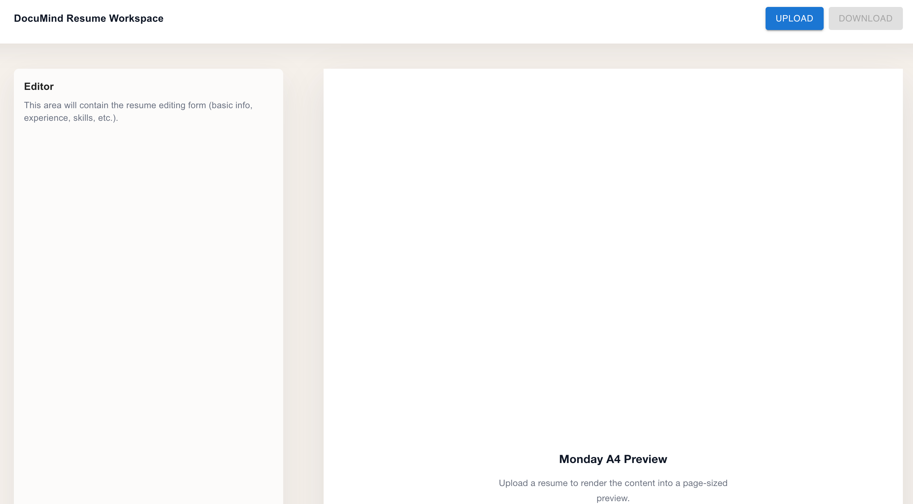
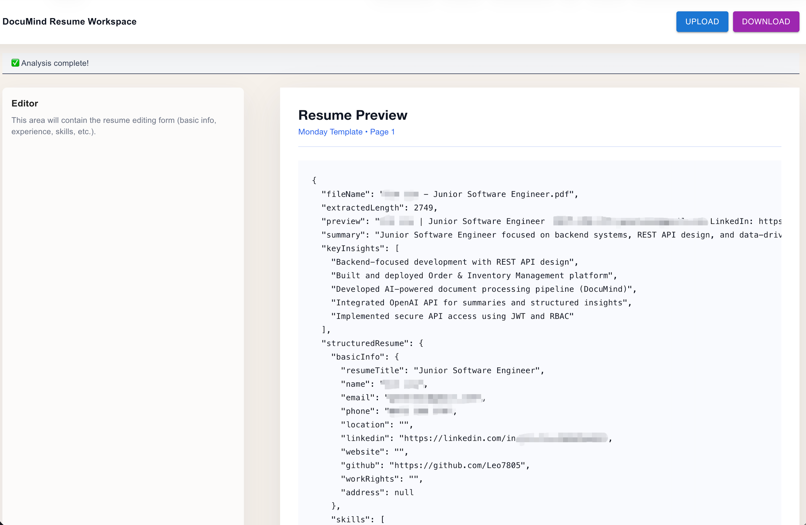

# DocuMind

DocuMind is a full-stack document analysis system that processes PDF resumes, extracts structured data, and presents
AI-generated insights through a web interface.

This project demonstrates how to design and build an end-to-end application integrating frontend, backend APIs, and AI
services to handle unstructured data workflows.

---

## Demo

### Upload Page



### Analysis Result



---

## Overview

DocuMind provides a complete pipeline for document processing:

- Upload PDF resumes via a web interface (Next.js)
- Process documents through backend APIs (ASP.NET Core)
- Integrate AI services for analysis (OpenAI)
- Return structured JSON data
- Visualise results in the frontend

The system focuses on building production-style workflows for real-world document processing scenarios.

---

## Key Features

- Upload and process PDF resumes via a web UI
- Extract text from PDFs using PdfPig
- Transform unstructured data into structured JSON models
- Generate AI-powered summaries and key insights
- Separate deterministic extraction (sourceSummary) from AI-generated output (summary)
- Display structured results in a frontend interface (Next.js + MUI)
- End-to-end flow from user interaction to backend processing and response rendering

---

## Architecture

### Frontend

- Next.js (TypeScript)
- Tailwind CSS
- Material UI (MUI)
- Handles file upload, API integration, and result visualisation

### Backend

- ASP.NET Core (Minimal API)
- Responsible for document processing and orchestration

### Core Services

- PdfService – Extracts text from PDF documents
- OpenAiService – Handles AI requests and response parsing
- PromptBuilder – Ensures consistent and structured AI outputs
- API Layer – Exposes REST endpoints

---

## Workflow

1. User uploads a PDF resume via the frontend
2. Frontend sends the file to `/analyze` API (multipart/form-data)
3. Backend extracts text and prepares AI prompt
4. OpenAI processes the content and returns structured output
5. Backend parses and validates the response
6. Frontend displays summary and insights

---

## API

### POST /analyze

Uploads a PDF resume and returns structured analysis.

**Response Example:**

```json
{
  "summary": "...",
  "sourceSummary": "...",
  "keyInsights": ["..."],
  "structuredResume": {}
}
```

---

## Tech Stack

**Frontend**

- Next.js (React, TypeScript)
- Material UI (MUI)

**Backend**

- ASP.NET Core (Minimal API)
- C#

**AI & Processing**

- OpenAI API
- PdfPig

**Other**

- RESTful API design
- Swagger / OpenAPI

---

## Engineering Highlights

- Designed an end-to-end system integrating frontend, backend, and AI services
- Built RESTful APIs to support file upload and structured data workflows
- Implemented robust error handling for external API responses
- Structured AI outputs into consistent JSON schemas
- Separated deterministic parsing from probabilistic AI outputs for reliability
- Developed a frontend interface to validate backend workflows through real user interaction

---

## Status

Functional MVP completed.

Core workflow is implemented end-to-end:  
PDF upload → backend analysis → structured response → frontend result display.

Currently improving response parsing reliability and structured JSON validation.

---

## Roadmap

- Improve structured JSON parsing and validation reliability
- Add editable resume templates
- Support PDF and HTML export
- Extend the system towards a production-ready resume generation workflow

---

## Author

Jin Liu (Leo)  
Full Stack Developer (Backend-focused)
